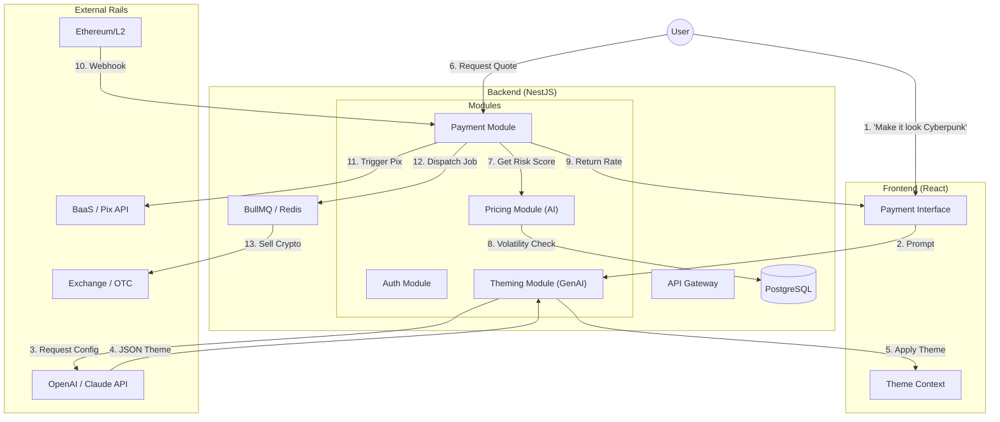

# 🇧🇷 Crypto-to-Pix Bridge (Liquidity & Settlement Layer)

> **Warning**: This project involves real financial assets. Use at your own risk. Ensure proper legal compliance (CNPJ/IP/BaaS) before deploying to production.

## 📖 Overview

This is a full-stack TypeScript application (React/NestJS) that facilitates **instant** crypto-to-fiat payments. It utilizes a **Treasury Float** model to settle Pix transactions immediately upon blockchain detection.

The project features a modular **NestJS** backend with two distinct AI engines:

1. **Pricing Engine**: An LSTM-based model for dynamic volatility risk assessment.
2. **Theme Engine**: A Generative AI service that builds custom UI themes (Tailwind configs) on the fly based on user prompts or brand identity.

## 🏗 Architecture

### High-Level Flow

1. **Ingestion**: User sends crypto (ETH/USDC) to a generated deposit address.
2. **Smart Quote**: System analyzes market volatility to generate a dynamic fee (Smart Spread).
3. **Instant Payout**: System *immediately* dispatches BRL via Pix (Stark Bank/Efí) from the Treasury Float.
4. **Liquidation**: A background worker sells the received crypto on an exchange to rebalance the Float.

### System Diagram



## 🛠 Tech Stack

* **Language**: TypeScript (Monorepo via Turborepo)
* **Frontend**: React, TailwindCSS, Viem, **Shadcn UI** (Themable components)
* **Backend**: **NestJS** (Modular Architecture)
* **AI/ML**:
* **Pricing**: TensorFlow.js (Volatility Prediction)
* **Theming**: OpenAI API (JSON Mode) for generating Tailwind Design Tokens


* **Database**: PostgreSQL (Prisma ORM)
* **Queue**: Redis (BullMQ)
* **Crypto Ops**: `ccxt`, `ethers.js`
* **Banking**: Stark Bank / Efí APIs

## 🧩 NestJS Modules Breakdown

### 1. `src/pricing` (AI Smart Spread)

**The Risk Engine.** Implements a `PricingService` provider.

* **Logic**: Injects `VolatilityModel` to analyze Order Book depth.
* **Decorator**: `@RiskCheck()` guard that blocks quotes during extreme market crashes.

### 2. `src/payment` (Core Logic)

Handles the Float and Settlement logic.

* **Controller**: `POST /quote`, `POST /webhook/blockchain`.
* **Provider**: `LiquidationService` (The Bot) runs as a Cron Job or Queue Processor to sell crypto inventory.

### 3. `src/theming` (AI UI Customization)

**The Generative Design Engine.** Allows for "White-labeling on the fly."

* **Endpoint**: `POST /theme/generate`
* **Input**: Prompt (e.g., *"A dark mode interface for a high-end luxury bank, gold accents"*)
* **Process**: Calls LLM to generate a JSON object containing color palettes, border radii, and font settings.
* **Output**:
```json
{
  "primary": "#D4AF37",
  "background": "#0F0F0F",
  "radius": "0.5rem",
  "font": "Playfair Display"
}

```


### 4. `src/bank` (Fintech Rail)

Encapsulates the Pix provider (Stark Bank).

* **Feature**: Uses NestJS **Interceptors** to log every fiat movement to an immutable audit table before the request hits the banking API.

## 🚀 Getting Started

### Prerequisites

* Node.js v20+
* Docker & Docker Compose
* **OpenAI API Key** (for Theming)

### Environment Variables

```bash
# NestJS
PORT=3000
DATABASE_URL="postgresql://..."

# AI Configuration
OPENAI_API_KEY="sk-..."
VOLATILITY_WINDOW_SECONDS=600

# Liquidity & Banking
CEX_ID="mercadobitcoin"
BANK_API_URL="https://sandbox.api.starkbank.com/v2"

```

### Installation

```bash
# Install dependencies
npm install

# Spin up Infrastructure
docker-compose up -d

# Start NestJS (Watch Mode)
npm run start:dev

```

## 🛡 Security & Risk

* **Input Validation**: Uses `class-validator` DTOs to ensure theme prompts do not contain injection attacks.
* **Rate Limiting**: `ThrottlerModule` applied to the AI Theming endpoint to prevent API cost spikes.
* **Volatility**: The `LiquidationService` must have higher priority in the Redis Queue than the Theming service.

## 📜 License

MIT 
